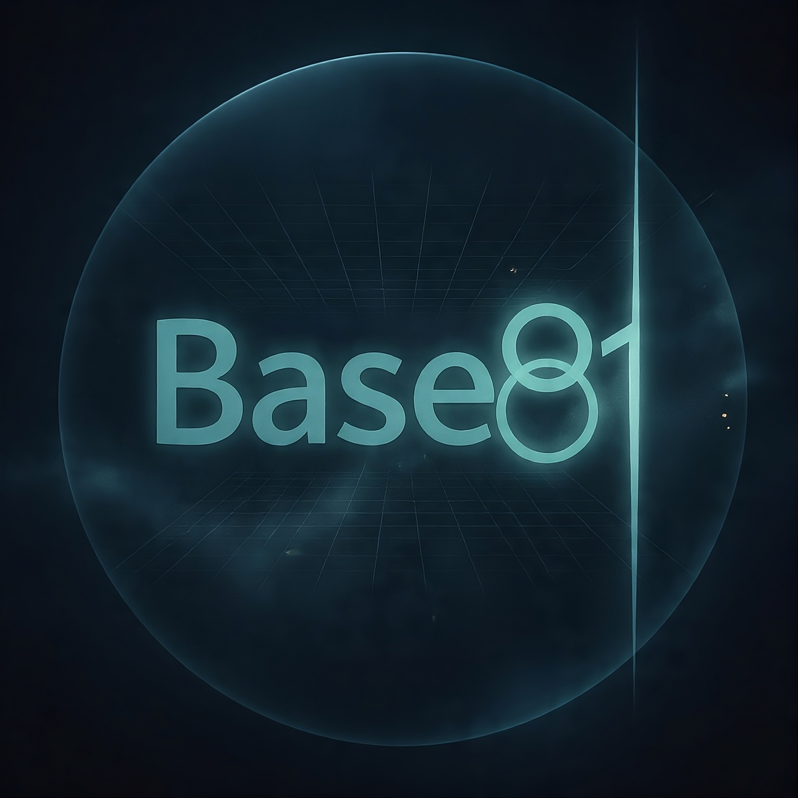

# Contributing to Base81/62



## Quick Start

```bash
git clone https://github.com/MalachiGreen/Base81
cd Base81
pip install -e ".[dev]"
pytest
```

## Project Structure

```text
base81/          # Main package
├── _api.py      # Public encode/decode
├── _stream.py   # Streaming Encoder/Decoder
├── _math.py     # Radix conversion (no deps)
├── _codecs.py   # Codec registry
├── _header.py   # ^b81:N:type^ framing
├── _alphabet.py # Character sets
├── _exceptions.py # Error hierarchy
└── _cli.py      # CLI entrypoint
tests/           # pytest suite (90%+ coverage required)
docs/            # Markdown docs
```

## Development Rules

### 1. Zero Dependencies (Strict)
- No third-party packages beyond stdlib
- `dev` extras may include `pytest`, `mypy` (not runtime)
- If you need it, justify in PR with 3 alternatives considered

### 2. Maintain Invariants (Critical)

```python
# These must ALWAYS hold:
assert decode(encode(data)) == data  # Roundtrip
assert encode(b'', block_size=7) == ''  # Empty handled
assert '^' not in ALPHABET_STANDARD and '^' not in ALPHABET_URL  # Header safe
```

### 3. Code Style
- Python 3.8+ compatible (no walrus `:=`, no `|` for unions)
- Black formatting (line length 100)
- Type hints on all public functions
- No `# type: ignore` without comment explaining why

### 4. Testing Requirements- **New codec**: Must include roundtrip test for all sizes `0..fn*2`
- **New feature**: Tests for success, failure, edge cases (empty, max size)
- **Bug fix**: Test that fails without fix, passes with it
- Run `pytest --cov=base81 --cov-report=term-missing` (aim for ≥90%)

### 5. Performance
- No O(n²) algorithms in hot paths (`encode`/`decode`/`update`)
- Profile before optimizing: `python -m cProfile -s time tests/bench.py`
- Keep streaming overhead <5% vs one-shot

## Adding a New Codec

1. Add entry in `_codecs.py`:

```python
# For new (alphabet, block_size) pair
tE, tD = {}, {}
for r in range(1, fn):
    k = 1
    while POW[radix][k] < POW[256][r]:
        k += 1
    tE[r], tD[k] = k, r
_add(alphabet, block_size, fn, fk, tE, tD)
```

2. Update `list_codecs()` returns
3. Add CLI support in `_cli.py` (choices list)
4. Tests: `test_codecs.py` + roundtrip for all sizes

## Pull Request Requirements

- One logical change per PR (not "fix bug and refactor and add feature")
- Update docs if API changes (`APP_DOCUMENTATION.md`)
- Pass CI: `pytest` + `mypy --strict` + (no new warnings)
- Describe your change:

```markdown
## What
[One sentence]

## Why
[Problem being solved]

## Testing
[How verified]
```

## Common Rejection Reasons

- ❌ Adds dependency (unless stdlib equivalent doesn't exist)- ❌ Breaks streaming API invariants
- ❌ Changes public function signatures without deprecation path
- ❌ Unhandled edge case (empty, max length, overflow)
- ❌ Hardcoded timeout/limit without configurable parameter

## Debugging Checklist

Stuck? Verify in order:

1. `pytest tests/test_math.py -v` (primitives work?)
2. `python -c "from base81 import encode; print(encode(b'x'))"` (import works?)
3. `python -m base81` (self-test passes?)
4. Check buffer limits: `max_buffer >= fk + max_tail`
5. Check tail tables: `len(tail_enc) == fn - 1`

## Getting Help

- **Bug**: Open issue with minimal reproduction (5 lines or less)
- **Question**: Stack Overflow with `base81` tag
- **Security**: Email greenmalachi76@gmail.com (PGP in repo)

## License

MIT. By contributing, you agree your code will be MIT-licensed.
